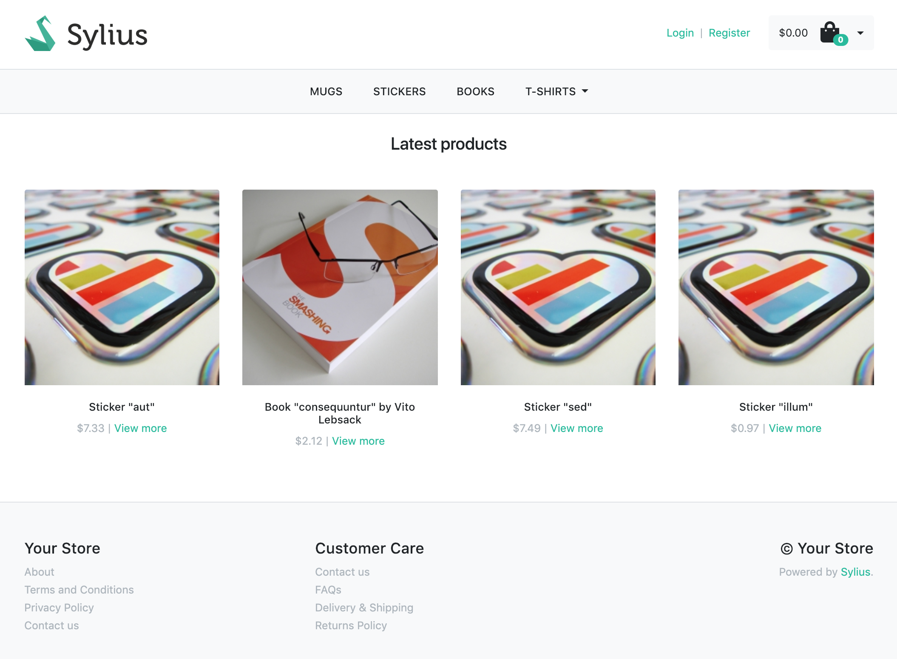
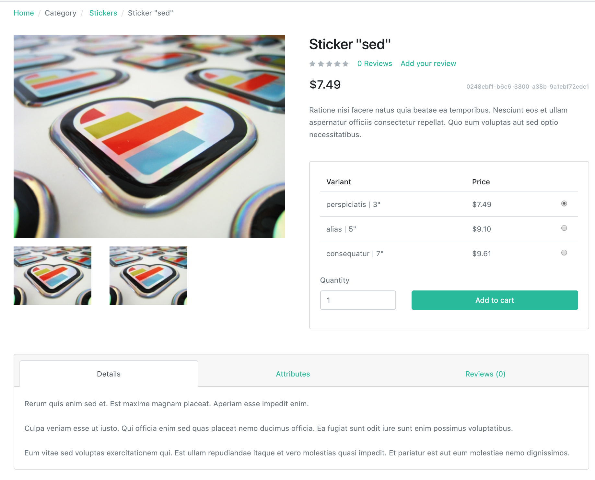
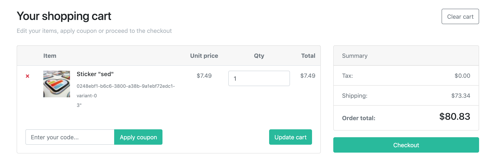
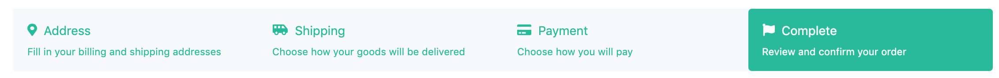
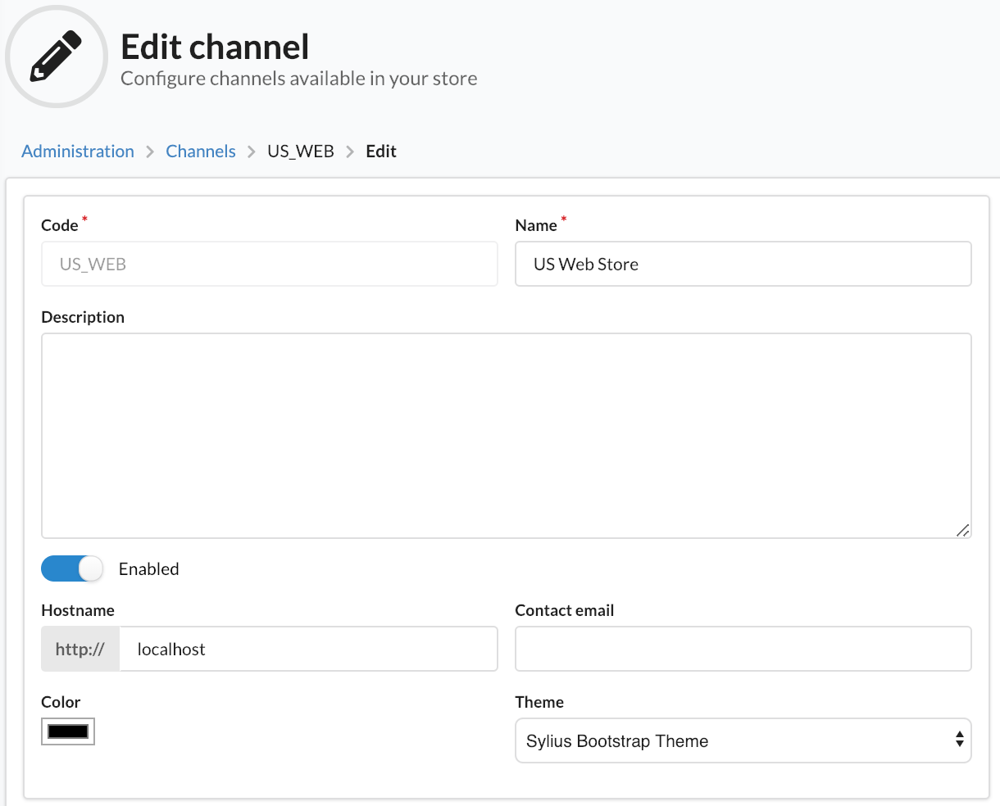

<p align="center">
    
    <h1 align="center">Sylius Bootstrap Theme</h1>
    <p align="center">Sylius Bootstrap theme with build process based on <a target="_blank" href="https://symfony.com/doc/current/frontend.html">Webpack Encore.</a></p>
    It allows to swap to Bootstrap-based theme separately in each channel.
</p>

Installation
------------

There are two ways to install a theme. It is possible to copy files in `themes/` or add this package as a composer dependency and create a child theme.

The instructions below refer to an installation in the theme folder. Installation as a composer dependency (with child theme) [is also documented](https://docs.sylius.com/en/latest/book/themes/bootstrap-theme.html).

Branch 0.1.x is only compatible with Sylius 1.6. Master is compatible with Sylius >= 1.7.0.

1. Copy files from repository to `./themes/BootstrapTheme`

2. Install Encore

    ```bash
    composer require encore
    ```
    
3. Install node dependencies

    ```bash
    yarn
    yarn add @symfony/webpack-encore sass-loader@^7.0.0 node-sass lodash.throttle -D
    yarn add bootstrap@^4.5.0 bootstrap.native@^3.0.0 glightbox axios form-serialize @fortawesome/fontawesome-svg-core @fortawesome/free-brands-svg-icons @fortawesome/free-regular-svg-icons @fortawesome/free-solid-svg-icons
    ```
   
4. Import bootstrap-theme config in the main webpack file

    ```bash
    # ./webpack.config.js
    
    const Encore = require('@symfony/webpack-encore');
    const bootstrapTheme = require('./themes/BootstrapTheme/webpack.config');
    module.exports = [bootstrapTheme];
    ```

5. Edit project config files

    ```bash
    # ./config/packages/assets.yaml
    
    framework:
        assets:
            packages:
                bootstrapTheme:
                    json_manifest_path: '%kernel.project_dir%/public/bootstrap-theme/manifest.json'  
    ```
    
    ```bash
    # ./config/packages/webpack_encore.yaml
    
    webpack_encore:
        output_path: '%kernel.project_dir%/public/build'
        builds:
            bootstrapTheme: '%kernel.project_dir%/public/bootstrap-theme'
    ```

6. To build the assets, run one of the following commands

    ```bash
    # compile assets once
    yarn encore dev      
    
    # recompile assets automatically when files change
    yarn encore dev --watch
    
    # recompile assets automatically with live reload
    yarn encore dev-server
    
    # create a production build
    yarn encore production
    ```

7. Change theme in the admin panel by visiting the Edit Channel page

Screenshots
-----------

#### Homepage



#### Product show




#### Cart



#### Checkout bar



#### Changing the theme


Running development environment using Docker
--------------------------------------------

This repository comes with a container setup that gives us a Sylius Standard instance with the theme pre-installed.
The container setup provides us with a `php` container used for executing requests that come in through http and for
running CLI commands.

To be able to receive http requests, there is the `nginx` container.
For the database there is the `mysql` container, running `Percona`.

Since we need to be able to run nodejs to build the frontend using webpack/encore, there is a `nodejs` container, which
when started will automatically start watching the frontend assets and rebuilds them when a file changes.

In order to test the emails and their respective templates, we have the `mailhog` container. Which catches all outbound
emails.

Finally, the `chrome` container is there so that we can execute automated browser tests using Behat/mink.

1. Building the container images:
    ```bash
    docker-compose build
    ```

2. Bring the containers up:
    ```bash
    docker-compose up -d
    ```

3. After the containers are up and running the shop can be setup as usual using the install feature:
    ```bash
    docker-compose exec php bin/console sylius:install
    ```

You should now be able to use Sylius in the browser using url: `http://localhost:8080`. (We're using port 8080 instead
of port 80 here, the reason for that is that port 80 is a port in the privileged range, so it requires root
permissions, whereas port 8080 does not).

**Optional:**
By default PHP 7.3 is used in the `php` container. However it is also possible to use a newer version:

1. Make `.env` file available:
    ```bash
    cp .env.dist .env
    ```

2. Set `PHP_VERSION` variable to `7.4`:
    ```dotenv
    PHP_VERSION=7.4
    ```

3. (Re)build the container images:
    ```bash
    docker-compose build
    ```

When running into performance issues it can be very helpful to be able to profile our code using [Blackfire](https://blackfire.io/).
To enable the installation of the probe:

1. Make `.env` file available (if you haven't already):
    ```bash
    cp .env.dist .env
    ```

2. Configure Blackfire
    ```dotenv
    BLACKFIRE=true
    BLACKFIRE_CLIENT_ID=[INSERT_YOUR_CLIENT_ID]
    BLACKFIRE_CLIENT_TOKEN=[INSERT_YOUR_CLIENT_TOKEN]
    BLACKFIRE_SERVER_ID=[INSERT_YOUR_SERVER_ID]
    BLACKFIRE_SERVER_TOKEN=[INSERT_YOUR_SERVER_TOKEN]
    BLACKFIRE_LOG_LEVEL=3
    ```

3. (Re)build the container images:
    ```bash
    docker-compose build
    ```
