<p align="center">
    
    <h1 align="center">SyliusBootstrapTheme</h1>
    <p align="center">Sylius Bootstrap theme with build process based on <a target="_blank" href="https://symfony.com/doc/current/frontend.html">Webpack Encore.</a></p>
</p>

## Preview

### Homepage

<a href="./docs/homepage-preview.png" target="_blank">
    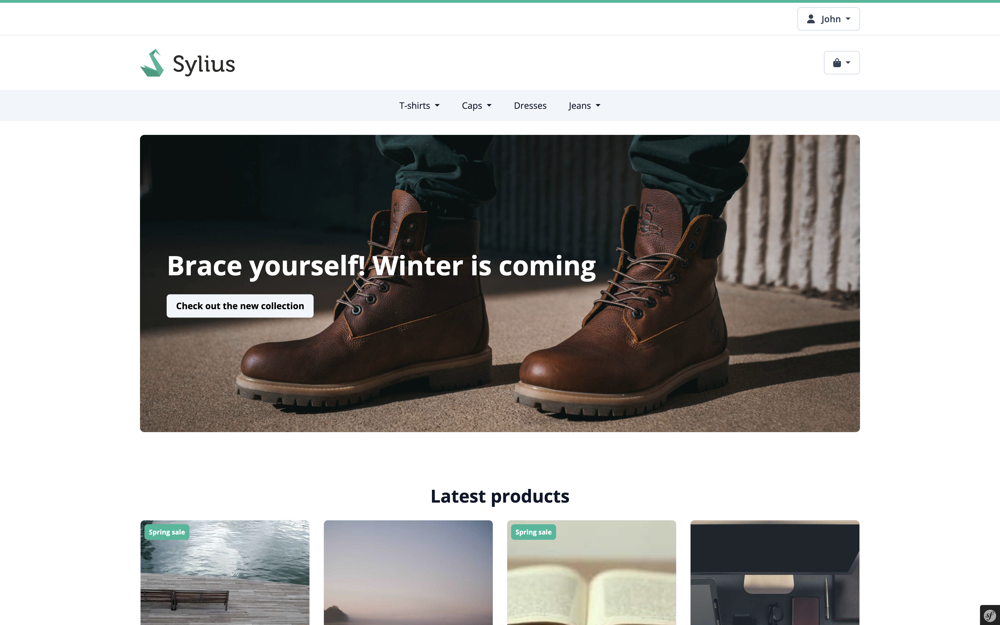
</a>
&nbsp;
<details>
    <summary>Gallery</summary>
    <hr>
    <a href="./docs/homepage-sections.png" target="_blank">
        
    </a>
</details>

### Checkout

<details>
    <summary>Gallery</summary>
    <hr>
    <a href="./docs/checkout-1.png" target="_blank">
        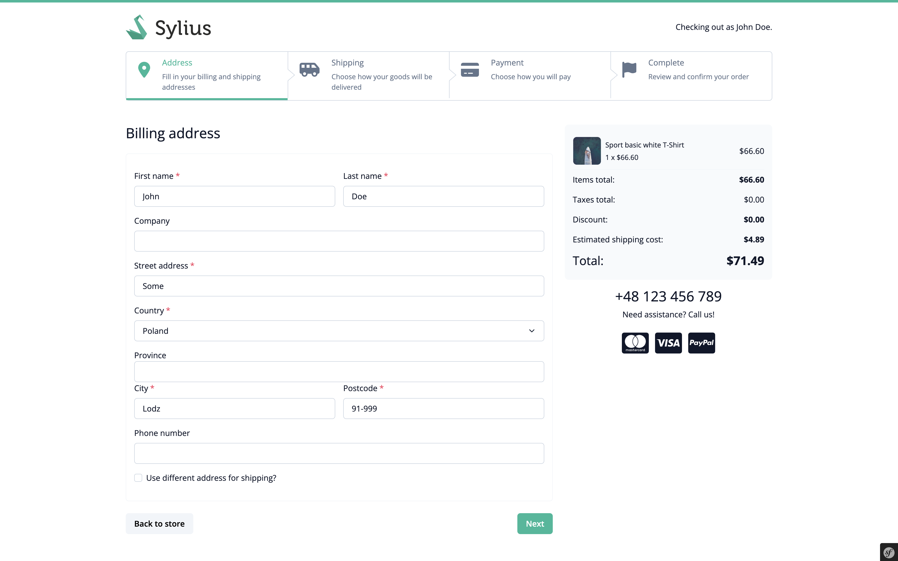
    </a>
    <hr>
    <a href="./docs/checkout-2.png" target="_blank">
        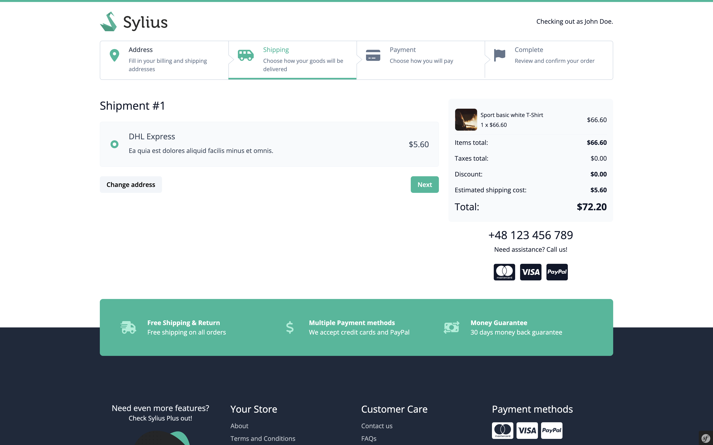
    </a>
    <hr>
    <a href="./docs/checkout-3.png" target="_blank">
        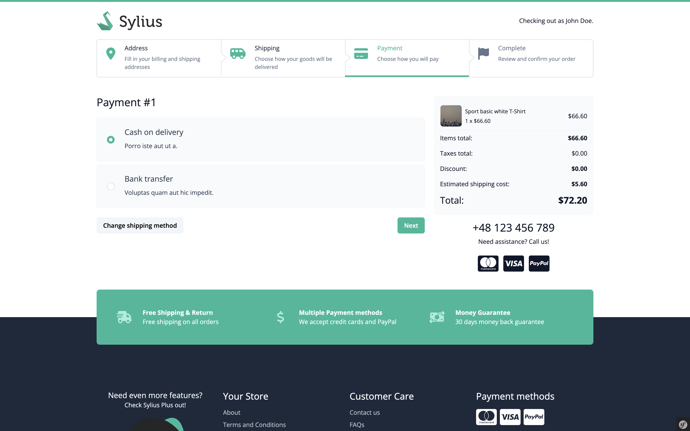
    </a>
    <hr>
    <a href="./docs/checkout-4.png" target="_blank">
        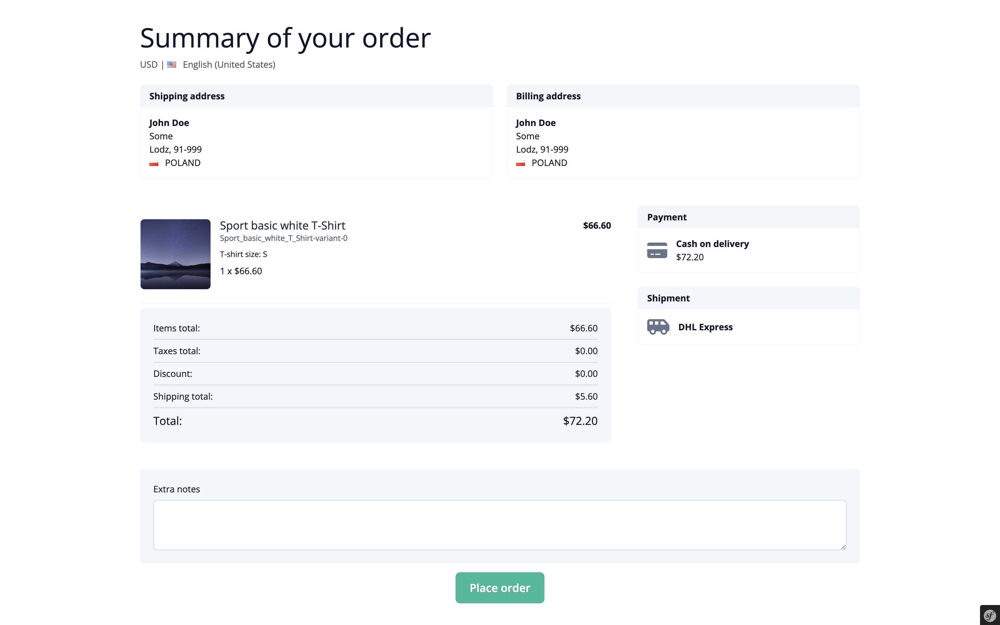
    </a>
    <hr>
    <a href="./docs/checkout-5.png" target="_blank">
        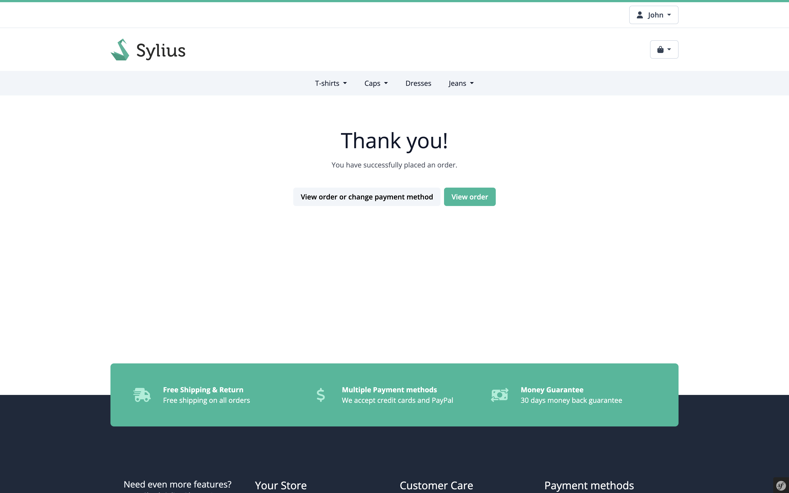
    </a>
</details>

### Products

<details>
    <summary>Gallery</summary>
    <hr>
    <a href="./docs/category.png" target="_blank">
        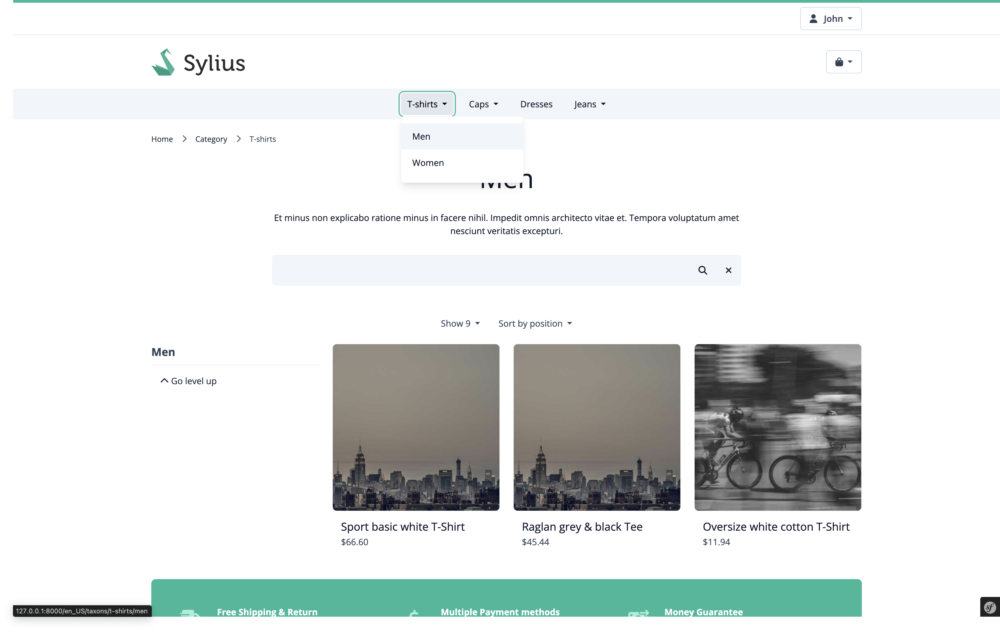
    </a>
    <hr>
    <a href="./docs/product-options.png" target="_blank">
        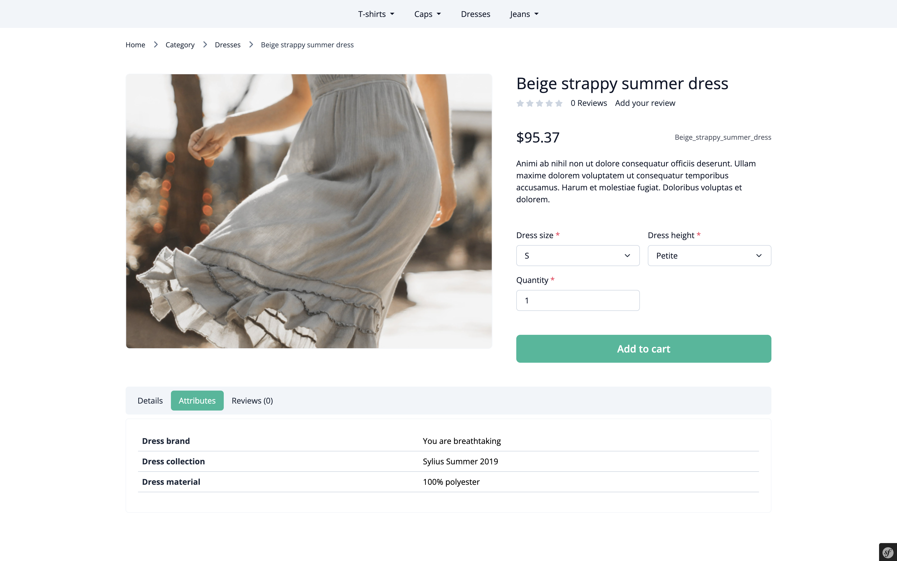
    </a>
    <hr>
    <a href="./docs/product-promotions.png" target="_blank">
        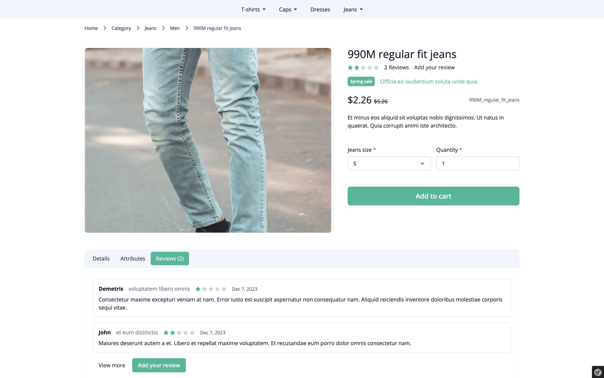
    </a>
</details>

### Cart

<details>
    <summary>Gallery</summary>
    <hr>
    <a href="./docs/cart-preview.png" target="_blank">
        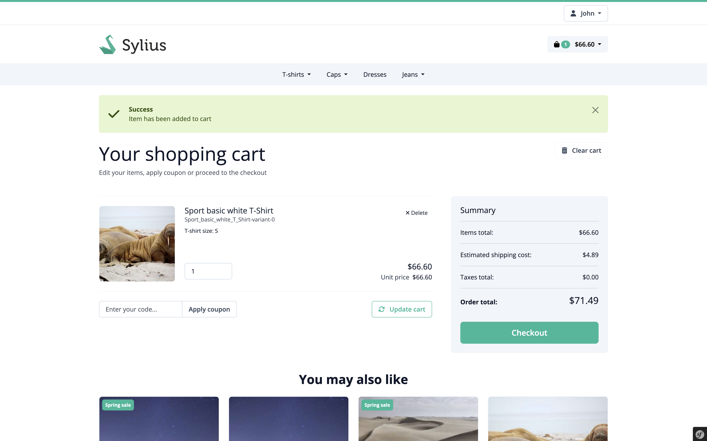
    </a>
    <hr>
    <a href="./docs/cart-dropdown.png" target="_blank">
        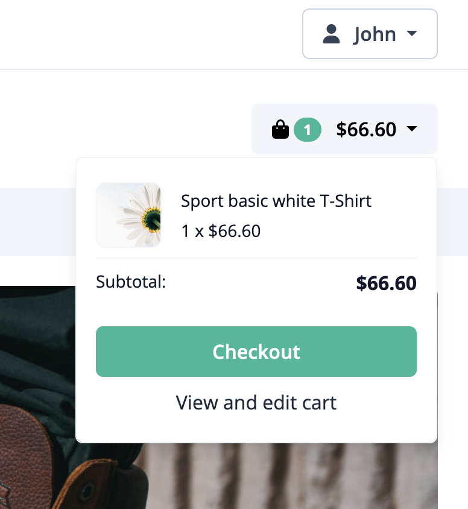
    </a>
</details>

### User account

<details>
    <summary>Gallery</summary>
    <hr>
    <a href="./docs/user-dashboard.png" target="_blank">
        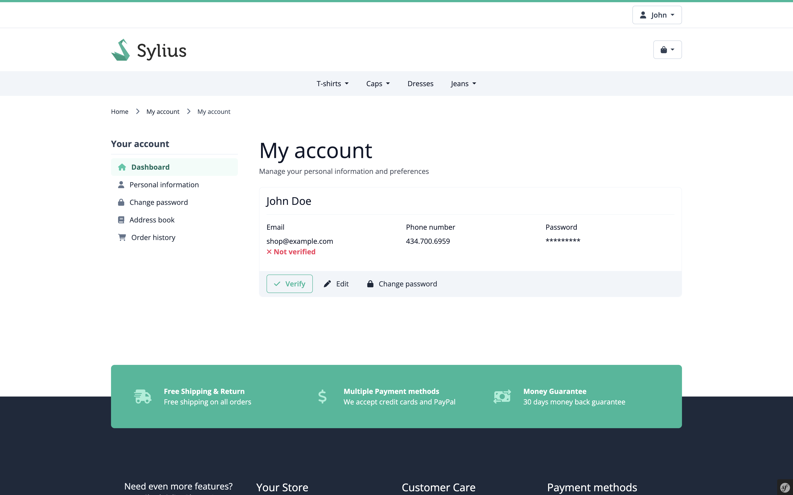
    </a>
    <hr>
    <a href="./docs/user-order-history.png" target="_blank">
        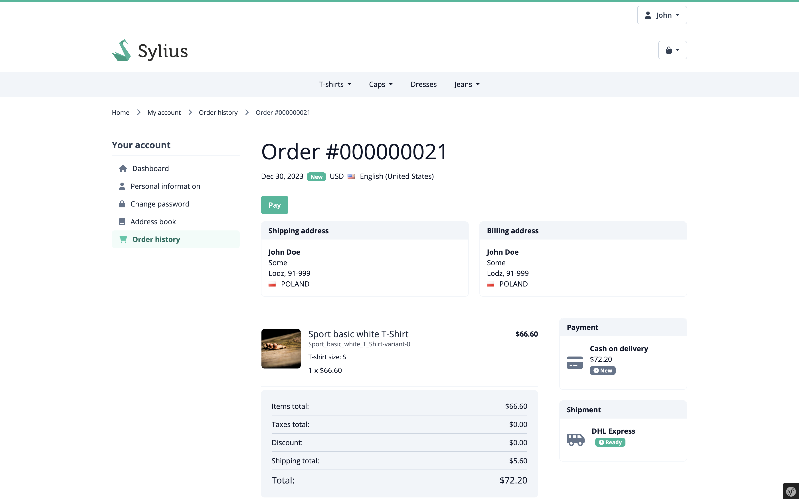
    </a>
    <hr>
    <a href="./docs/user-dropdown.png" target="_blank">
        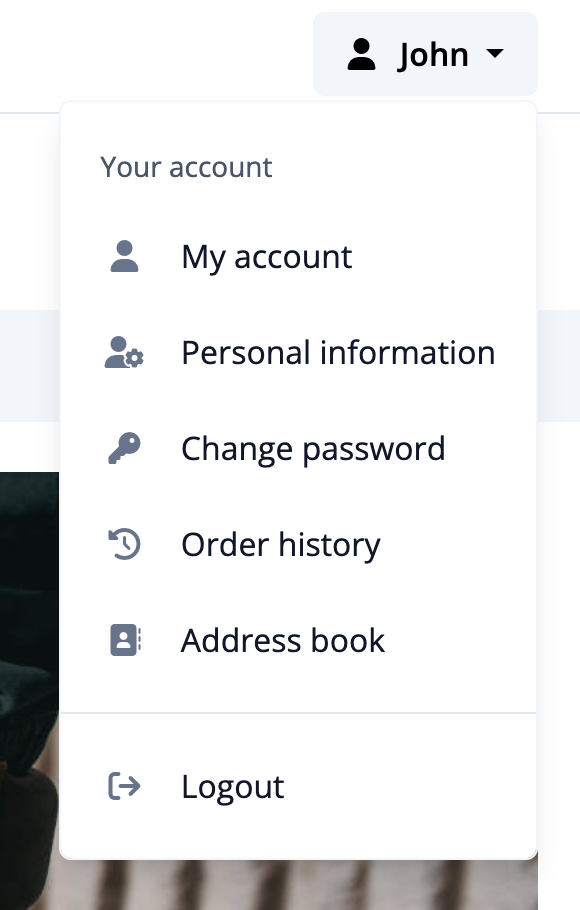
    </a>
</details>

## Installation

There are two ways to install a theme. It is possible to copy files in `themes/` or add this package as a composer dependency and create a child theme. The instructions below refer to an installation in the theme folder. 

### Composer installation

Installation as a composer dependency [is documented here](https://docs.sylius.com/en/latest/book/themes/bootstrap-theme.html)

```bash
composer require sylius/bootstrap-theme:1.12
```

### Manual installation

#### 1. Copy files from the repository to `./themes/BootstrapTheme`

Files/folders to copy:
* `assets`
* `templates`
* `composer.json`
* `webpack.config.js`

#### 2. Install node dependencies

```bash
yarn install
yarn add bootstrap@^5.3 @fortawesome/fontawesome-free@^6.4.2 lightbox axios @popperjs/core@^2.11 glightbox
```

#### 3. Import `bootstrap-theme` config in your `./webpack.config.js`

```diff
+ const bootstrapTheme = require('./themes/BootstrapTheme/webpack.config');

// ...

- module.exports = [shopConfig, adminConfig, appShopConfig, appAdminConfig];
+ module.exports = [shopConfig, adminConfig, appShopConfig, appAdminConfig, bootstrapTheme];
```

#### 4. Edit project configuration

```diff
# ./config/packages/assets.yaml

framework:
    assets:
        packages:
+            bootstrapTheme:
+                json_manifest_path: '%kernel.project_dir%/public/themes/bootstrap-theme/manifest.json'
```

```diff
# ./config/packages/webpack_encore.yaml

webpack_encore:
    output_path: '%kernel.project_dir%/public/build'
    builds:
+        bootstrapTheme: '%kernel.project_dir%/public/themes/bootstrap-theme'
```

#### 5. Build assets

```bash
# compile assets once
yarn dev

# recompile assets automatically when files change
yarn watch

# create a production build
yarn build
```

#### 6. Change theme in the admin panel

1. Go to `Configuration > Channels`
2. Edit desired channel from the list
3. Go to `Look & feel > Theme` section
4. Change theme to `Sylius Bootstrap Theme` 


## Contribution

### Quickstart Installation

#### Localhost

This command will install the selected version of Sylius and the Bootstrap theme with its configuration.
You just need to activate the theme in admin panel as described in the point above.

:information_source: To be able to setup the plugin database, remember to configure you database credentials
in `install/Application/.env.local` and/or `install/Application/.env.test.local`.

```bash
$ make install -e SYLIUS_VERSION=XX SYMFONY_VERSION=YY PHP_VERSION=ZZ
```

Default values : XX=1.12.0 and YY=6.3 and ZZ=8.2

:information_source: To reset (drop database and delete files) test environment:
```bash
$ make reset
```
